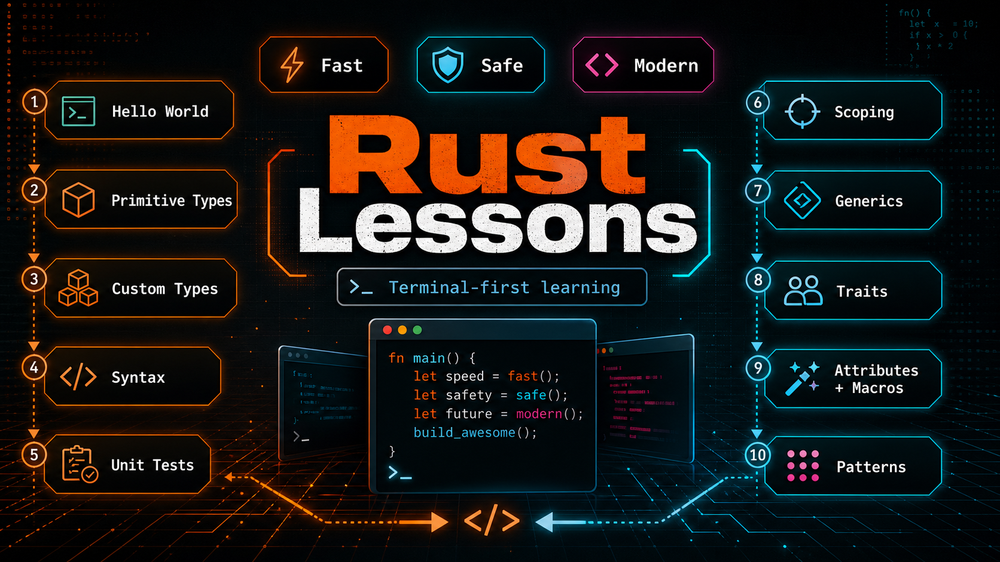

# Rust Lessons

Small, self-contained Rust lesson crates for learning the language one terminal
program at a time.

## TOC

- [Rust Lessons](#rust-lessons)
  - [TOC](#toc)
  - [Pics](#pics)
  - [Gettings started](#gettings-started)
- [Details](#details)
  - [Structure](#structure)
  - [Features](#features)
- [Credits](#credits)

## Pics

### Infographic

## Gettings started

### Common Scripts

| Script | Required? | Description |
| ------ | --------- | ----------- |
| [`Install_Dependencies.ps1`](./Scripts/Common/Install_Dependencies.ps1) | ✅ | Verifies Rust tooling and builds the workspace. |
| [`Run_Lesson_01_HelloWorld.ps1`](./Scripts/Common/Run_Lesson_01_HelloWorld.ps1) | ✅ | Runs the first hello-world lesson. |
| [`Run_Lesson_02_PrimitiveTypes.ps1`](./Scripts/Common/Run_Lesson_02_PrimitiveTypes.ps1) | ❌ | Runs the primitive types lesson. |
| [`Run_Lesson_03_CustomTypes.ps1`](./Scripts/Common/Run_Lesson_03_CustomTypes.ps1) | ❌ | Runs the custom types lesson. |
| [`Run_Lesson_04_Syntax.ps1`](./Scripts/Common/Run_Lesson_04_Syntax.ps1) | ❌ | Runs the syntax lesson. |
| [`Run_Lesson_05_UnitTests.ps1`](./Scripts/Common/Run_Lesson_05_UnitTests.ps1) | ❌ | Runs the unit tests lesson. |
| [`Run_Lesson_06_Scoping.ps1`](./Scripts/Common/Run_Lesson_06_Scoping.ps1) | ❌ | Runs the scoping lesson. |
| [`Run_Lesson_07_Generics.ps1`](./Scripts/Common/Run_Lesson_07_Generics.ps1) | ❌ | Runs the generics lesson. |
| [`Run_Lesson_08_Traits.ps1`](./Scripts/Common/Run_Lesson_08_Traits.ps1) | ❌ | Runs the traits lesson. |
| [`Run_Lesson_09_AttributesAndMacros.ps1`](./Scripts/Common/Run_Lesson_09_AttributesAndMacros.ps1) | ❌ | Runs the attributes and macros lesson. |
| [`Run_Lesson_10_Patterns.ps1`](./Scripts/Common/Run_Lesson_10_Patterns.ps1) | ❌ | Runs the patterns lesson. |

### Other Scripts

| Script | Required? | Description |
| ------ | --------- | ----------- |
| [`RunTests.ps1`](./Scripts/Other/RunTests.ps1) | ❌ | Runs the Lesson 05 unit tests. |

  

# Details

## Structure

### Root Folders

| # | Name | In Git? | Purpose |
| - | ---- | ------- | ------- |
| 01 | [`.codex`](./.codex) | ✅ | Repo-local Codex guidance and future project-specific skills. |
| 02 | [`Lessons`](./Lessons) | ✅ | Rust workspace crates for each terminal lesson. |
| 03 | [`Scripts`](./Scripts) | ✅ | PowerShell setup and lesson runner scripts. |
| 04 | [`target`](./target) | ❌ | Cargo build output; generated and not source. |

### Source Folders

| Path | Description |
| ---- | ----------- |
| [`Lessons/Lesson_01_HelloWorld`](./Lessons/Lesson_01_HelloWorld) | Prints your first Rust message. |
| [`Lessons/Lesson_02_PrimitiveTypes`](./Lessons/Lesson_02_PrimitiveTypes) | Logs Rust's everyday value types. |
| [`Lessons/Lesson_03_CustomTypes`](./Lessons/Lesson_03_CustomTypes) | Creates your own simple types. |
| [`Lessons/Lesson_04_Syntax`](./Lessons/Lesson_04_Syntax) | Practices common Rust control flow. |
| [`Lessons/Lesson_05_UnitTests`](./Lessons/Lesson_05_UnitTests) | Checks small functions with tests. |
| [`Lessons/Lesson_06_Scoping`](./Lessons/Lesson_06_Scoping) | Shares values without losing control. |
| [`Lessons/Lesson_07_Generics`](./Lessons/Lesson_07_Generics) | Reuses code across many types. |
| [`Lessons/Lesson_08_Traits`](./Lessons/Lesson_08_Traits) | Gives different types shared behavior. |
| [`Lessons/Lesson_09_AttributesAndMacros`](./Lessons/Lesson_09_AttributesAndMacros) | Adds metadata and code shortcuts. |
| [`Lessons/Lesson_10_Patterns`](./Lessons/Lesson_10_Patterns) | Builds reusable problem-solving examples. |

## Features

### Rust Lessons

This grid tracks the current lesson set. Each lesson is terminal-only.

Related tech: [Rust By Example](https://doc.rust-lang.org/rust-by-example/)

| # | Name | Description | Terminal Output? | Docs |
| - | ---- | ----------- | ---------------- | ---- |
| 01 | [`Lesson_01_HelloWorld`](./Lessons/Lesson_01_HelloWorld) | Print your first Rust message. | ✅ | [Rust By Example](https://doc.rust-lang.org/rust-by-example/hello.html) |
| 02 | [`Lesson_02_PrimitiveTypes`](./Lessons/Lesson_02_PrimitiveTypes) | Log Rust's everyday value types. | ✅ | [Rust By Example](https://doc.rust-lang.org/rust-by-example/primitives.html) |
| 03 | [`Lesson_03_CustomTypes`](./Lessons/Lesson_03_CustomTypes) | Create your own simple types. | ✅ | [Rust By Example](https://doc.rust-lang.org/rust-by-example/custom_types.html) |
| 04 | [`Lesson_04_Syntax`](./Lessons/Lesson_04_Syntax) | Practice common Rust control flow. | ✅ | [Rust By Example](https://doc.rust-lang.org/rust-by-example/flow_control.html) |
| 05 | [`Lesson_05_UnitTests`](./Lessons/Lesson_05_UnitTests) | Check small functions with tests. | ✅ | [Rust By Example](https://doc.rust-lang.org/rust-by-example/testing.html) |
| 06 | [`Lesson_06_Scoping`](./Lessons/Lesson_06_Scoping) | Share values without losing control. | ✅ | [Rust By Example](https://doc.rust-lang.org/rust-by-example/scope.html) |
| 07 | [`Lesson_07_Generics`](./Lessons/Lesson_07_Generics) | Reuse code across many types. | ✅ | [Rust By Example](https://doc.rust-lang.org/rust-by-example/generics.html) |
| 08 | [`Lesson_08_Traits`](./Lessons/Lesson_08_Traits) | Give different types shared behavior. | ✅ | [Rust By Example](https://doc.rust-lang.org/rust-by-example/trait.html) |
| 09 | [`Lesson_09_AttributesAndMacros`](./Lessons/Lesson_09_AttributesAndMacros) | Add metadata and code shortcuts. | ✅ | [Rust By Example](https://doc.rust-lang.org/rust-by-example/attribute.html) |
| 10 | [`Lesson_10_Patterns`](./Lessons/Lesson_10_Patterns) | Build reusable problem-solving examples. | ✅ | [Rust Design Patterns](https://rust-unofficial.github.io/patterns/) |

  

# Credits

**Created By**

Samuel Asher Rivello. Over 25 years XP with game development (2025); over 10
years XP with Unity (2025).

**Contact**

| Channel | Link |
| ------- | ---- |
| Twitter | [@srivello](https://twitter.com/srivello) |
| Git | [Github.com/SamuelAsherRivello](https://github.com/SamuelAsherRivello) |
| Resume & Portfolio | [SamuelAsherRivello.com](https://www.SamuelAsherRivello.com) |
| LinkedIn | [Linkedin.com/in/SamuelAsherRivello](https://www.linkedin.com/in/SamuelAsherRivello) |
